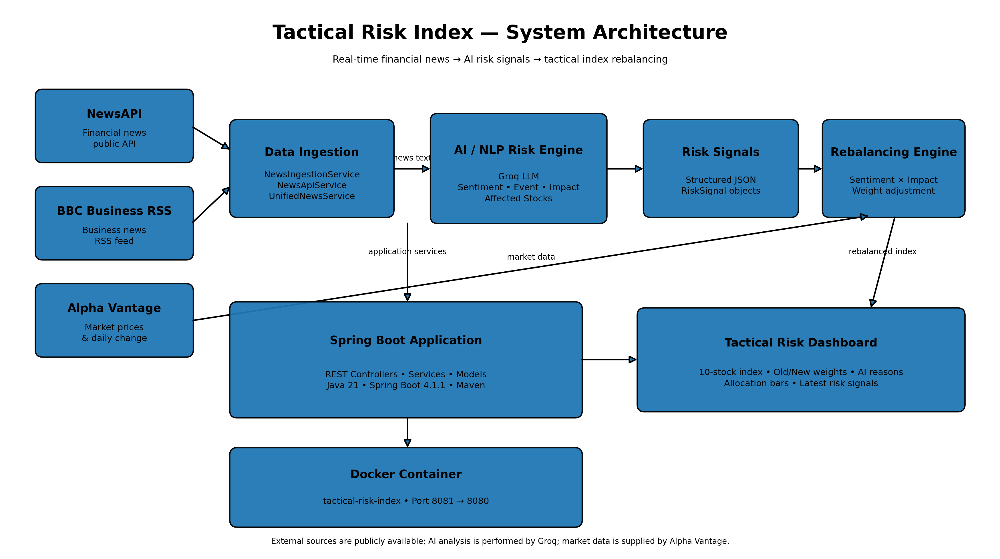

# Tactical Risk Index - S&P Global & Crisil Campus Hackathon 2026

**Candidate Name:** Rashi Verma  
**College Email ID:** rashi.23bce10005@vitbhopal.ac.in
**College / Campus:** VIT Bhopal University  
**Demo Video Link:** [To be added]  
**Slide Deck:** [To be added]

---

## 1. Project Overview / Problem Statement & Approach

Financial markets are continuously affected by unstructured information such as financial news, corporate announcements, regulatory events, geopolitical developments, and market-moving events. Processing this information manually is slow and makes it difficult to react consistently to emerging risks.

The Tactical Risk Index is an AI-powered financial risk analysis and index rebalancing prototype. The system ingests publicly available financial news from multiple sources, uses a Groq-powered LLM to transform unstructured headlines into structured risk signals, and dynamically adjusts the weights of a mock 10-stock index based on sentiment and impact.

The system produces:

- Sentiment Score (-1.0 to +1.0)
- Sentiment classification
- Event classification
- Impact Score (1-10)
- Reason for the risk assessment
- Affected stock tickers

These signals are then consumed by the Tactical Rebalancing Engine to increase or decrease stock weights while maintaining a 100% portfolio allocation.

---

## 2. Architecture & Tech Stack

### Architecture



### Data Flow

```text
Financial News Sources
        |
        v
News Ingestion Layer
        |
        v
Groq AI / NLP Risk Engine
        |
        +--> Sentiment Score
        +--> Event Type
        +--> Impact Score
        +--> Affected Stocks
        |
        v
Risk Signals
        |
        v
Tactical Rebalancing Engine
        |
        +--> Increase positive stocks
        +--> Decrease negative stocks
        |
        v
10-Stock Tactical Index
        |
        v
Dashboard